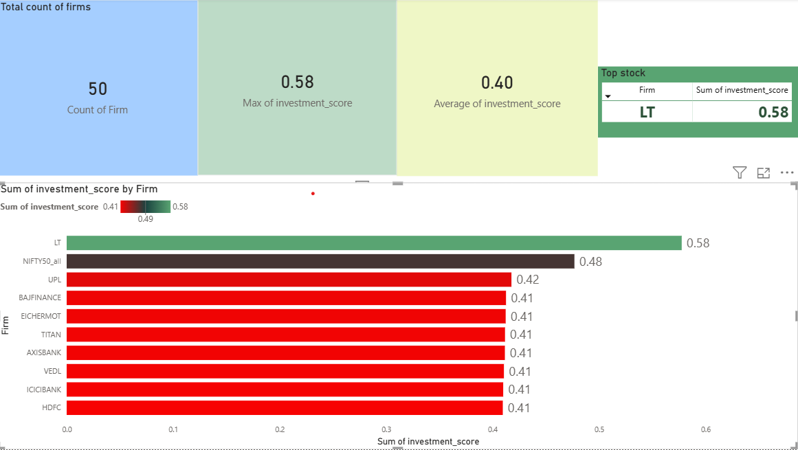
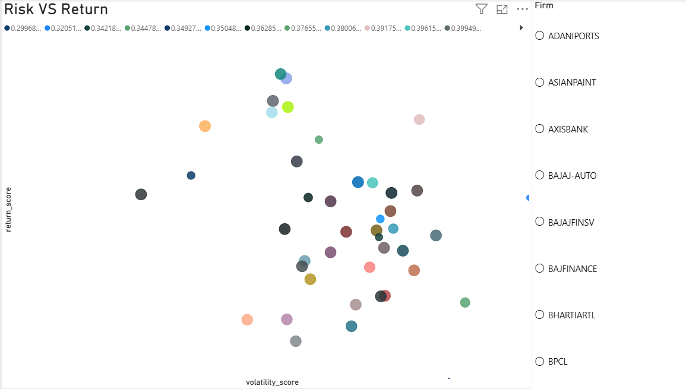

# 📊 Investment Scoring System

## 🚀 Project Overview

This project focuses on building a data-driven Investment Scoring System to evaluate and rank firms based on multiple financial and performance indicators.  
The objective is to convert raw business data into meaningful scores that support smarter investment decisions.

---

## 🎯 Objectives

- Analyze firm performance using structured data
- Build a scoring model using key indicators
- Rank firms based on investment potential
- Generate business insights through data visualization
- Support decision-making with an interactive dashboard

---

## 🛠️ Tools & Technologies

- Python
- Pandas
- NumPy
- Scikit-learn
- Power BI
- SQL
- Jupyter Notebook

---

## 📈 Project Workflow

1. Data Cleaning & Preprocessing  
2. Exploratory Data Analysis  
3. Feature Engineering  
4. Investment Score Calculation  
5. Ranking Firms  
6. Dashboard Creation  
7. Business Insights & Recommendations

---

## 📊 Key Features

- Weighted scoring model
- Firm ranking system
- Interactive dashboard
- Insight-driven decision support
- Clean and structured workflow

---

## 📷 Dashboard Preview



## 📉 Risk vs Return Analysis



## 💡 Learnings

- Data preprocessing for business use cases
- Scoring logic design
- Dashboard storytelling
- Applying analytics for decision-making

---

## 📌 Future Improvements

- Deploy as Streamlit web app
- Add predictive modeling
- Real-time data integration
- Automated scoring pipeline

---
## 🌐 Streamlit Web App

This project also includes an interactive Streamlit application for exploring firm rankings, dataset previews, and risk vs return insights.

### Run Locally

```bash
pip install -r requirements.txt
streamlit run app.py
---

## 👤 Author

Ash  
Data & AI Enthusiast
